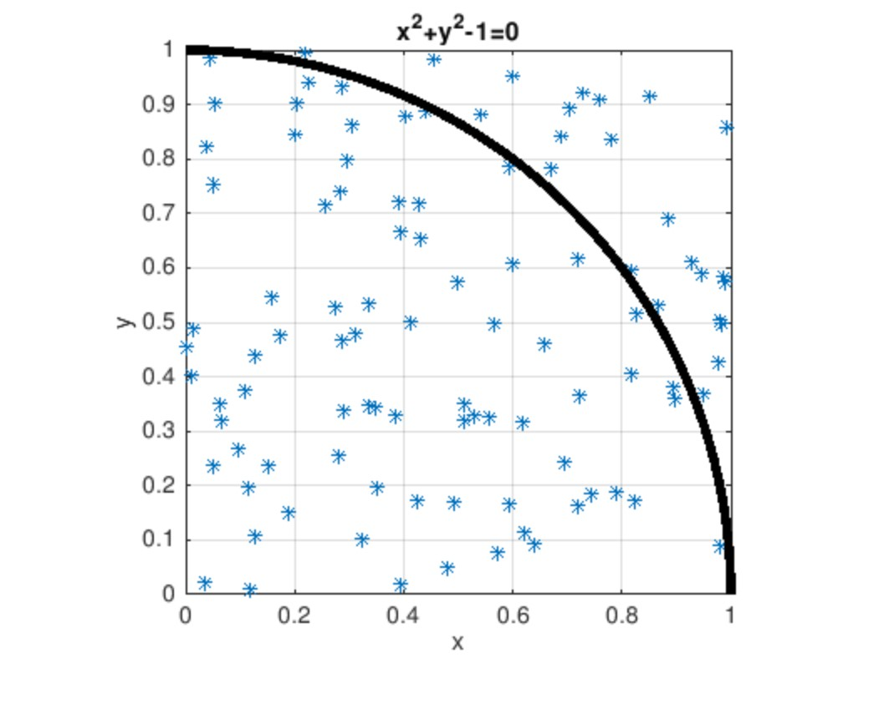
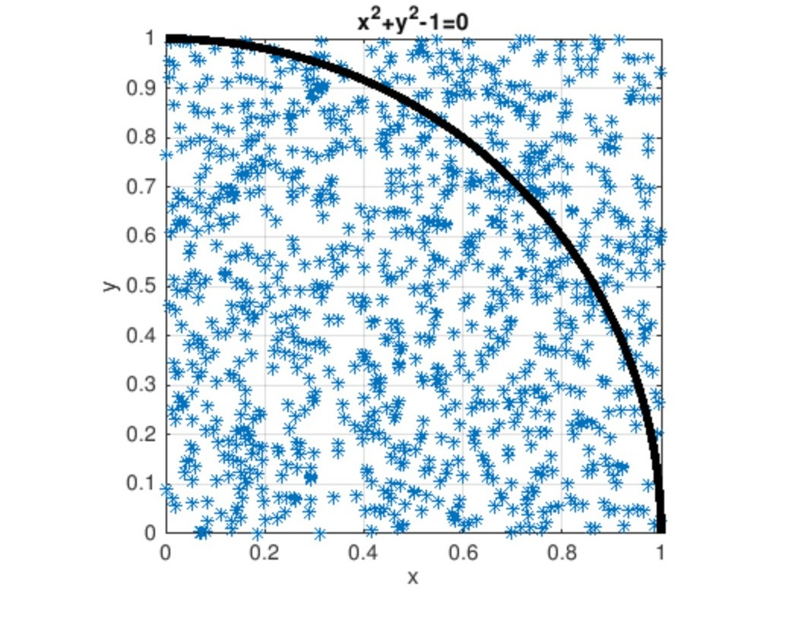
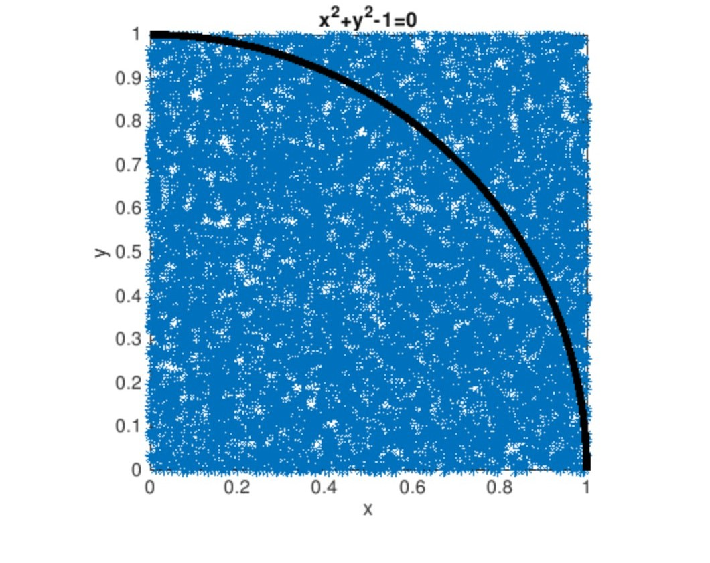
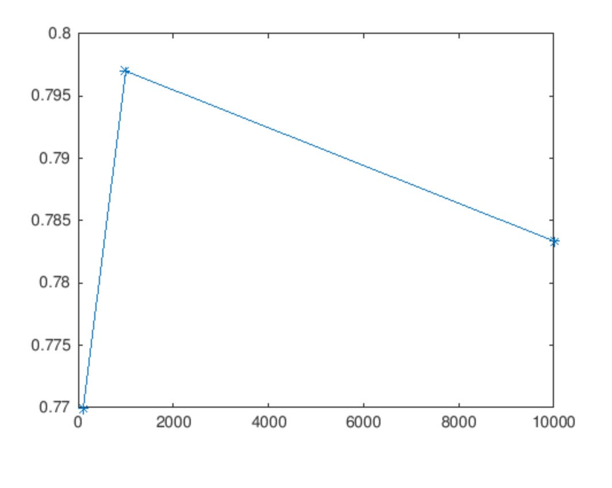

# Monte Carlo

Using `Monte Carlo` method to calculate the unit quarter circle area(Pi/4) in `Matlab`.

## Getting started

### Usage

- Set the sample size in `monteCarlo.m`

    ```matlab
    2 totalPointCounts = [100, 1000, 1000]
    ```

- Run `monteCarlo.m`

### Testing

Sample size:

```matlab
totalPointCounts = [100, 1000, 1000]
```

100 points:



1000 points:



10000 points:



Result:

