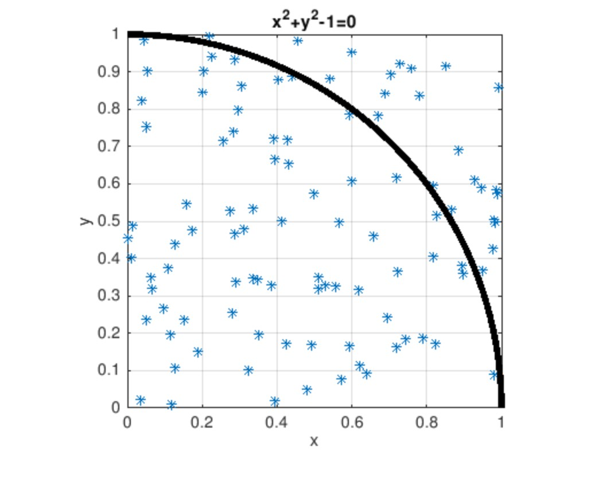
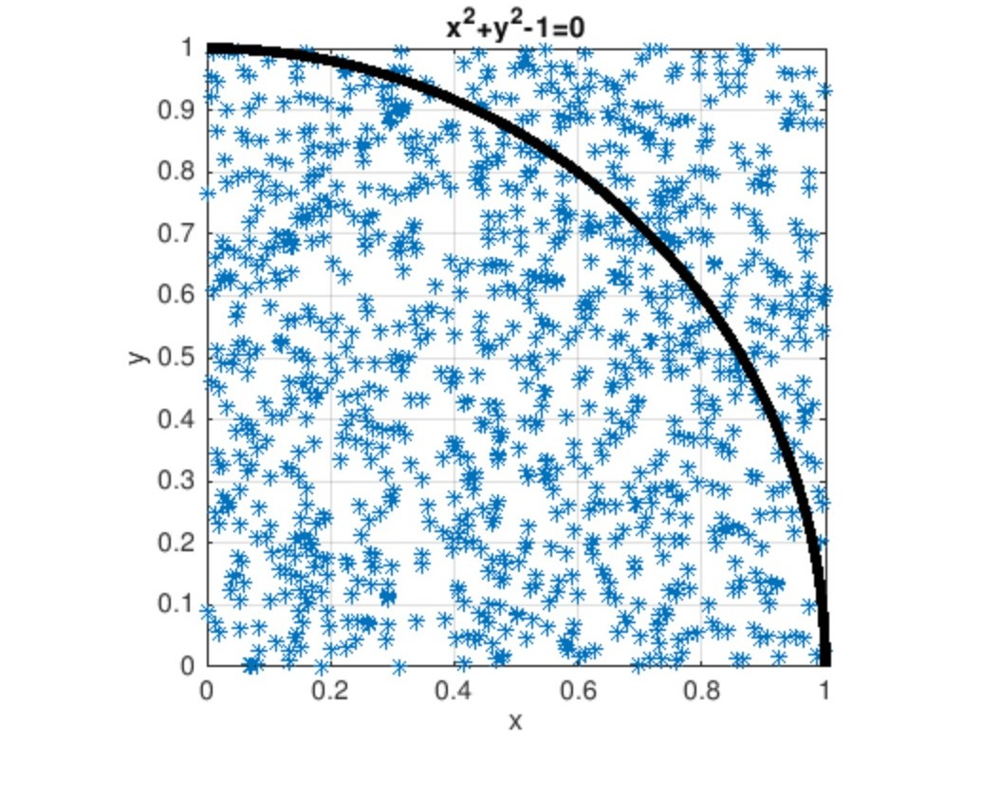
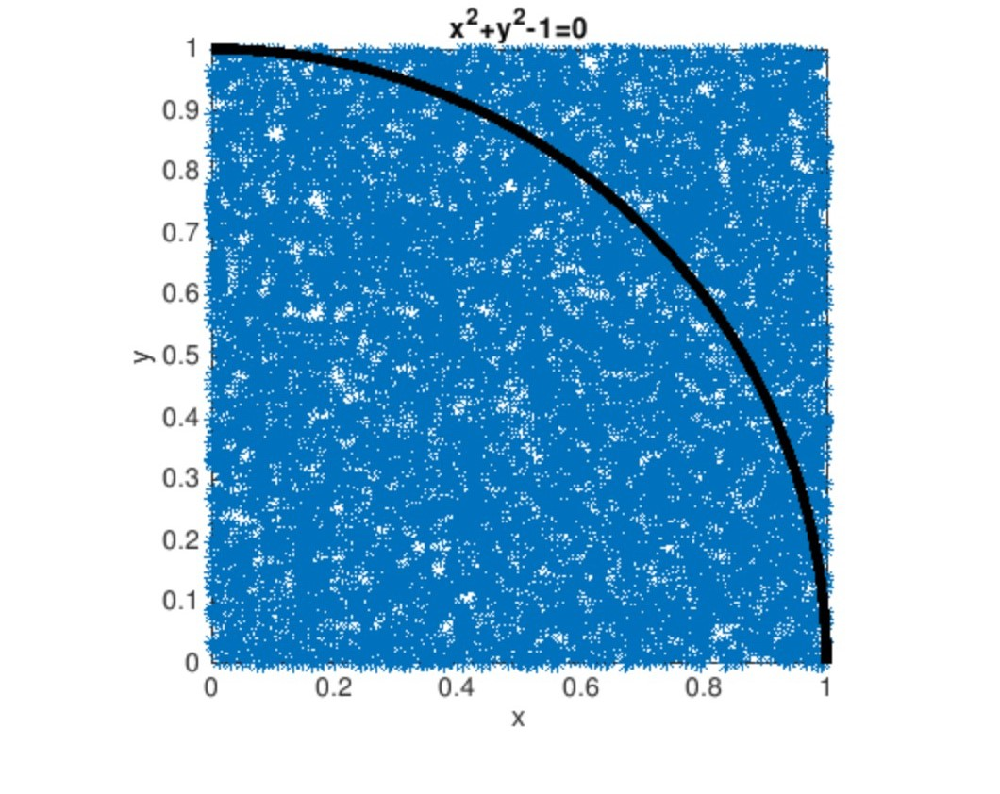

## Calculate unit quarter circle area(Pi/4)

Calculate the unit quarter circle area using `Monte Carlo` method in `Matlab`.

## Get started

### Prerequisite

Set the number of points for each case in `calculateUnitQuarterCircleArea.m`

```
totalPointCounts = [count1, count2, count3...]
```

### Usage
run `calculateUnitQuarterCircleArea.m`

### Testing

```
totalPointCounts = [100, 1000, 1000]
```







